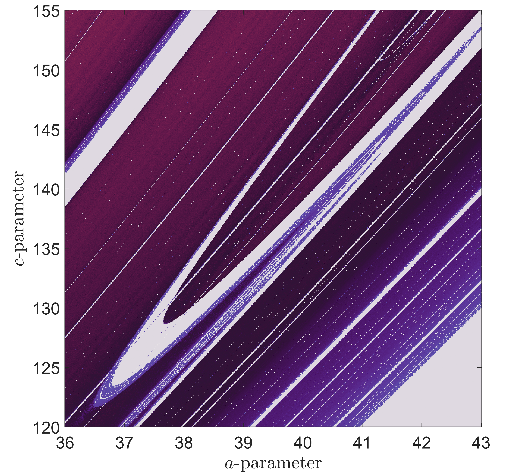

# Parameter Sweep - CUDA Accelerated Dynamical System Analysis

CUDA加速的动力学系统参数扫描分析工具，用于绘制混沌系统的双参数分岔图和Lyapunov指数等图像。

## 项目简介

本项目实现了基于CUDA GPU加速的参数扫描算法，用于分析三维动力学系统的双参数分岔行为。通过并行计算大幅提升大规模参数扫描的效率。

## 系统要求

### 硬件要求
- NVIDIA GPU (计算能力sm_86或更高)
- 至少6GB显存

### 软件要求
- MATLAB R2022a或更高版本
- CUDA Toolkit 12.8
- Visual Studio 2019 (MSVC v142)
- Windows 10/11

## 安装步骤

### 1. 安装依赖

确保已安装以下软件：
- [MATLAB R2022a+]
- [CUDA Toolkit 12.8]
- [Visual Studio 2019 Community]

### 2. 配置编译器

在MATLAB中配置Visual Studio 2019编译器：

```matlab
% 设置环境变量
setenv('VSINSTALLDIR', 'C:\Program Files (x86)\Microsoft Visual Studio\2019\BuildTools');
setenv('VS160COMNTOOLS', 'C:\Program Files (x86)\Microsoft Visual Studio\2019\BuildTools\Common7\Tools');
setenv('MW_ALLOW_ANY_CUDA', '1');

% 配置编译器
mex -setup C++
```

### 3. 编译CUDA代码

运行编译脚本：

```matlab
cd src/matlab/bisweep
build_sweep_mex
```

或者手动编译：

```matlab
mexcuda -v '../../cuda/bisweep/sweep_mex.cu' ...
    NVCCFLAGS='-arch=sm_86 --generate-code=arch=compute_86,code=sm_86 -Wno-deprecated-gpu-targets' ...
    -L"C:\Program Files\NVIDIA GPU Computing Toolkit\CUDA\v12.8\lib\x64" ...
    -lcudart ...
    -output sweep_mex
```

## 使用方法

### 基本用法

运行主程序：

```matlab
main
```

### 参数设置

在 `main.m` 中修改以下参数：

```matlab
% 参数范围
parameter1Start = 34;       % 参数a起始值
parameter1End = 35;         % 参数a结束值
parameter1Count = 101;      % 参数a采样点数

parameter2Start = 99;       % 参数c起始值
parameter2End = 101;        % 参数c结束值
parameter2Count = 101;      % 参数c采样点数

parameter3 = 1;             % 固定参数b

% 积分设置
dt = 0.01;                  % 时间步长
N = 1e6;                    % 迭代次数
stride = 1;                 % 采样间隔

% Kneading区间
kneadingsStart = 1000;
kneadingsEnd = 2023;
```

## 结果展示

### 双参数扫描结果


### 分岔图


### Lyapunov指数



### Bykov_T点


## 许可证

本项目采用MIT许可证 - 详见 [LICENSE](LICENSE) 文件

## 致谢

- https://blog.csdn.net/slandarer/article/details/127719784 - MATLAB颜色映射工具


## 联系方式

如有问题或建议，请通过GitHub Issues联系。

---

**注意**：本项目需要NVIDIA GPU支持，请确保你的硬件满足要求。
